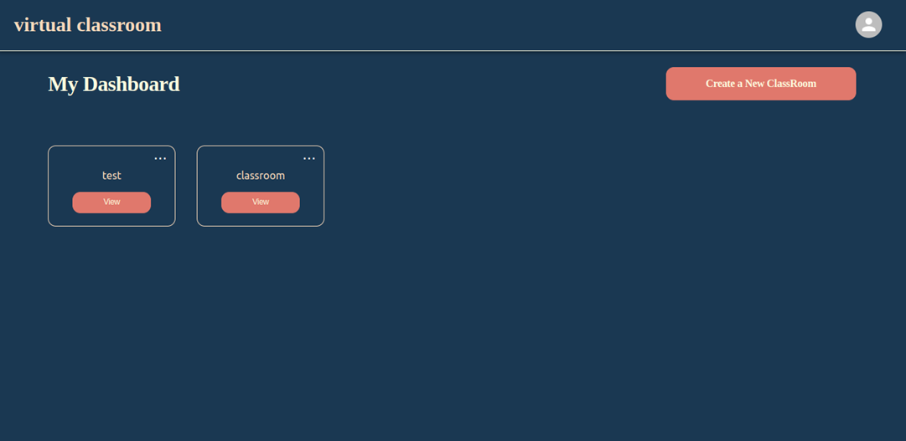

# graduation-project-classroom-api
api to manage classrooms and quiz's for graduation project vr and front end parts
project is under development


[](https://app.getpostman.com/run-collection/17623503-78bafc83-7901-4698-bd41-0c3389636035?action=collection%2Ffork&source=rip_markdown&collection-url=entityId%3D17623503-78bafc83-7901-4698-bd41-0c3389636035%26entityType%3Dcollection%26workspaceId%3D281a1dde-5ec5-496a-a87d-c71655f1ec03)

<br>

### API URL at render
`https://classroom-api.onrender.com`


## Requirements
- Java Development Kit (JDK) 17 or above
- PostgreSQL Database (You can either use a local PostgreSQL instance or connect to a remote one)

## How to Run
1. Clone the project repository from Git (if it's not already cloned).
2. Import the project into your favorite Java IDE (e.g., IntelliJ, Eclipse, etc.).
3. Build the project to resolve dependencies.

## Configure Properties

### JWT Values
JWT (JSON Web Token) is used for authentication purposes, and here's how you can configure its value:


#### jwt values
`jwt_secret: oIhbd+QIyZnylJiHfnjjXcnHGXMicUqu9+no8qHAyXw=`

Replace the value after jwt_secret: with your desired JWT secret key.

### PostgreSQL Configuration
This section includes the database configuration using PostgreSQL. 
You'll need to specify the database URL, username, and password.

```yaml
#postgres config
spring:
  datasource:
    url: jdbc:postgresql://dpg-ci4ln3dph6eva34s0md0-a.oregon-postgres.render.com:5432/class_room
    username: class_room_user
    password: gwjeYYLoCFCKI6wcwHgk2MYDuo5SmrX0
#    url: jdbc:postgresql://localhost:5432/classroom_api?createDatabaseIfNotExist=true
#    username: postgres
#    password: admin
    driver-class-name: org.postgresql.Driver
```

If you are running a local PostgreSQL instance, you can comment out the first set of URL, username, and password lines and uncomment the second set, and update them with your local database credentials.

### Hibernate Configuration
This section includes Hibernate configuration properties for JPA.

```yaml
spring:
  jpa:
    hibernate:
      ddl-auto: update
    show-sql: true
    properties:
      hibernate:
        format_sql: false

```

These properties control how Hibernate manages the database schema and SQL logs. The above configuration specifies that Hibernate should update the schema automatically (ddl-auto: update) and show SQL queries in the console (show-sql: true). You can adjust these settings according to your requirements.

### Logging Configuration
This section configures logging levels for the application.
In this example, the logging level for the package com.tawfeek.quizApi is set to DEBUG.

```yaml
logging:
  level:
    com.tawfeek.quizApi: DEBUG

```
You can customize logging levels for different packages or classes based on your debugging needs.


Once you have configured the properties and set up the database, you can run the Spring Boot application from your IDE. The application will start, and you can access it through the specified endpoints and interact with it based on your project's functionality.

## How to Run Using Maven
To run the Spring Boot application using Maven, follow these steps:

1. Open a terminal (command prompt) window or a terminal within your IDE.

2. Navigate to the root directory of the Spring Boot project, where the `pom.xml` file is located.

3. Build the project using Maven by executing the following command:

   ```bash
   mvn clean package
   ```

   This command will compile the Java code, run tests, and package the application into a JAR file.

4. Once the build is successful, you can run the Spring Boot application using the following command:

   ```bash
   mvn spring-boot:run
   ```

   Maven will start the embedded Tomcat server and deploy your application. You should see logs indicating that the application is running.

5. By default, the application will be accessible at `http://localhost:8080`. Open your web browser and navigate to this URL to access the application.

6. If you need to stop the running application, you can press `Ctrl + C` in the terminal where the application is running. This will terminate the Spring Boot application.

**Note:** Ensure that you have properly configured the properties, such as the database URL, username, and password, in the `application.yml` file before running the application. Also, make sure that your PostgreSQL database is running and accessible before starting the Spring Boot application.

Now, you can interact with your Spring Boot application through the specified endpoints and test its functionality.

## Docker
To dockerize the Spring Boot project using the provided Dockerfile, follow these steps:

1. Make sure you have Docker installed on your machine.

2. Save the provided Dockerfile in the root directory of your Spring Boot project, alongside the `pom.xml` file.

3. Open a terminal (command prompt) window or a terminal within your IDE.

4. Navigate to the root directory of your Spring Boot project, where the Dockerfile is located.

5. Build the Docker image using the following command:

   ```bash
   docker build -t quiz-api:latest .
   ```

   This command tells Docker to build an image with the tag `quiz-api:latest` using the current directory (`.`) as the build context.

6. Once the Docker build is successful, you can run the Docker container based on the built image using the following command:

   ```bash
   docker run -p 8080:8080 quiz-api:latest
   ```

   This command runs a Docker container based on the `quiz-api:latest` image and maps port 8080 from the container to port 8080 on the host machine, allowing you to access the Spring Boot application at `http://localhost:8080`.

7. The Spring Boot application is now running inside the Docker container.

**Explanation of Dockerfile:**
- The Dockerfile uses multi-stage builds to keep the final image lightweight and efficient.
- The first stage (`build`) uses a Maven-based image to build the Java application. It copies the source code and `pom.xml`, then runs Maven to package the application as a JAR file.
- The second stage (`package`) uses the OpenJDK image to create a runtime image for the application. It copies the JAR file built in the first stage and sets it as the entry point to run the Spring Boot application.
- The `EXPOSE 8080` instruction exposes port 8080 inside the container.
- The `ENTRYPOINT` instruction sets the command that will be executed when the container starts. In this case, it runs the Spring Boot application using the `java -jar` command with the specified JAR file.

After following these steps, your Spring Boot application should be successfully dockerized and running inside a Docker container.


## ERD


## Big Project Arch


[Watch the Demo Quiz Classroom app](https://youtu.be/95lWnZfmaek)

[Watch the Demo VR room](https://youtu.be/S5wiChmP3ok)
## Tests
We also use unit tests using Junit5 and AssertJ and mocking using Mockito for Spring API unit testing.


We use postman for testing the REST API endpoints.  Postman is an API platform for building and using APIs. Postman simplifies each step of the API lifecycle and streamlines collaboration so you can create better APIs—faster.
Collection URL to test: https://www.postman.com/cloudy-equinox-313118/workspace/githubpublic/collection/17623503-78bafc83-7901-4698-bd41-0c3389636035?action=share&creator=17623503


## Images from the FrontEnd





